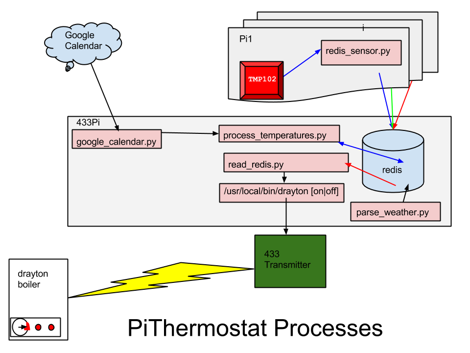

PiThermostat
============

Raspberry Pi using a HY28 LCD touchscreen (Texy or Adafruit PiTFT) and a TMP102 to make a thermostat display. Integrates with Google calendar or Django Schedule to find required temperature. Works with 433MHz sender board to make a complete boiler control. Currently works with British Gas and Drayton gas boilers.

More details about the 433 sender board used can be found https://github.com/tommybobbins/Raspi_433

The file structure of this project is as follows:
     
    This directory - Python scripts to move to /usr/local/bin
    utilities - useful associated scripts, but may not be required in all cases.
    init - init scripts to be moved to /etc/init.d/
    icons - graphics used by thermostat_gui.py. Can be moved, but icon_dir in thermostat_gui.py will need updating.
    utilities/433PlanB - to be used in the event of redis/thermostat_gui.py dying.

Requires the Adafruit libraries to read from the TMP102:

    git clone https://github.com/adafruit/Adafruit-Raspberry-Pi-Python-Code
    cp -rp Adafruit-Raspberry-Pi-Python-Code /usr/local/lib/python2.7/site-packages/

Install the Python Google API:

     sudo pip install google-api-python-client pytz evdev pygame redis smbus
     mkdir /etc/google_calendar/

Create a new Google calendar called thermostat. You need to allow access through to this calendar here: https://developers.google.com/google-apps/calendar/get_started . Download the client-secrets.json file and put it into /etc/google_calendar/

     sudo cp client-secrets.json /etc/google_calendar

Run the list_calendar.py
     
     cd utilities 
     python list_calendars.py --no_auth_local_webserver

This should create a sample.dat in the local directory. We need to copy this to /etc/google_calendar for neatness.
     
     sudo cp sample.dat /etc/google_calendar

The summary of all events in the calendar should be of the form 

     Temp=20.0

Installation of redis
=====================

     sudo apt-get install redis-server python-redis

Installation of the files
========================

## Setting up a Temperature sensor

This will setup the sensor for the attic.

    cd PiThermostat
    sudo cp utilities/redis_sensor.py /usr/local/bin/
    sudo cp init/redis_sensor.sh /etc/init.d/
    sudo insserv redis_sensor.sh

Copy the init script to /etc/init.d/temp.sh

    sudo cp utilities/temp.sh /etc/init.d/
    sudo insserv temp.sh

/etc/hosts should contain the name/location of the redis server:
    
    echo "192.168.1.223       433board" >>/etc/hosts

On the redis server, it is helpful to set a pre-existing weather and optimal temperature (the temperature you want it set to if all else fails):

     pi@raspberrypi ~ $ redis-cli
     redis 127.0.0.1:6379> set temperature/optimal 20
     OK
     redis 127.0.0.1:6379> set temperature/weather 6
     OK

The scripts to copy to /usr/local/bin are as follows:

call_433.py  # Makes redis calls to / from the redis server which maintains temperature states/ runs boiler
gettemperatures.py # Makes call to the TMP102 to grab the temperatures and calls call_433 to grab redis data.
google_calendar.py # Grabs current temperature required from Google Calendar.
processcalendar.py # Deprecated. Was used with django-schedule and is left her for future reference.
thermostat_gui.py  # Pygame binary to display data on screen and call all other libraries.

    sudo cp *.py /usr/local/bin/
    sudo chmod a+rx /usr/local/bin/
    /etc/init.d/temp.sh start

Edit the redis server configuration to allow incoming connections:

    sudo vi /etc/redis/redis.conf

Ensure that it looks like the following:

# If you want you can bind a single interface, if the bind option is not
# specified all the interfaces will listen for incoming connections.
#
#bind 127.0.0.1

Restart redis:

sudo /etc/init.d/redis-server restart

Using Weather (optional)
========================

Uses weather-util to retrieve weather info:

    sudo apt-get install weather-util

Edit retreive_weather.sh (it is currently set to Leeds/Bradford airport):

    sudo cp utilities/retrieve_weather.sh /usr/local/bin/
    sudo cp utilities/parse_weather.py /usr/local/bin/
    sudo chmod a+x /usr/local/bin/retrieve_weather.sh

    crontab -e
Add a line similar to the following to retrieve the weather for your location

    13 0,6,12,18 * * * /usr/local/bin/retrieve_weather.sh
========================

Setting up the Queue runner on the 433 server
=============================================

All jobs for the 433 transmitter get queued up on a redis server inside jobqueue. This means they can run sequentially stopping the transmitter from garbling two or more messages together. To process this queue, on the 433 sender we need to run a script:

    utilities/read_redis.py

This needs to run as root to get access to the GPIO pin 18 (in our case). It has some protection to only allow 3 binaries to run.  There is an associated init script:

    sudo cp utilities/read_redis.py /usr/local/bin/ 
    sudo cp utilities/murunner.sh /etc/init.d/
    sudo insserv murunner.sh

Django front end
=================

Setting up Django is beyond the scope of this document, but there are instructions on how to do this https://www.djangoproject.com/

Code is inside django. Copy to /usr/local/django and point apache mod_wsgi.conf there.

    cd /usr/local/django

    sudo python manage.py syncdb

    chmod a+rw home.db
