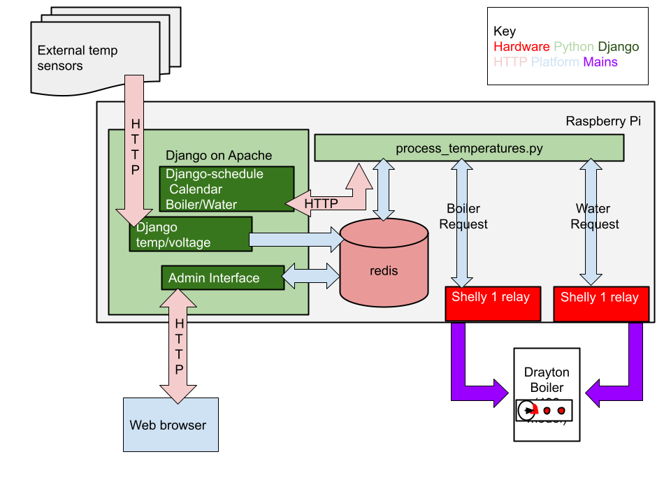

PiThermostat
============

Central heating system and/or Hot water system using a Raspberry Pi and optionally an LCD touchscreen. This project requires at least one TMP102 to make a thermostat. Integrates with Google calendar or Django Schedule to find required temperature. Works with one or two Shelly Relays to make a complete boiler control system.

The file structure of this project is as follows:
     
    This directory - Python scripts to move to /usr/local/bin
    utilities - useful associated scripts, but may not be required in all cases.
    init - init scripts to be moved to /etc/init.d/
    icons - graphics used by thermostat_gui.py. Can be moved, but icon_dir in thermostat_gui.py will need updating.
    bin - main utilities for running thermostat.
    utilities/433PlanB - to be used in the event of redis/thermostat_gui.py dying.

Install i2c using raspi-config
 
    sudo raspi-config

Select Advanced mode, enable i2c and then reboot

Most of the Work below can now be performed using make:

    make install

The summary of all events in the calendar should be of the form 

     Temp=20.0

If using a Water calendar, then this should be off the form Water=On or Water=Off

Note that Django-Schedule has supplanted Google Calendar as the default. Uncomment line 88 if you wish to use Google Calendar.

The scripts to copy to /usr/local/bin are as follows:

| Script | Description |
| ------------- | ------------- |
| call_433.py | Makes redis calls to / from the redis server which maintains temperature states/ runs boiler. |
| google_calendar.py | Grabs current temperature required from Google Calendar. |
| processcalendar.py | Deprecated. Was used with django-schedule and is left here for future reference. |
| thermostat_gui.py | Pygame binary to display data on screen and call all other libraries. |
| calculate_temps.py | Pull in the data from the temperature sensors and calculates an internal and external mean |

Using Weather (optional)
========================

Uses weather-util to retrieve weather info:

    sudo apt-get install weather-util

Edit retreive_weather.sh (it is currently set to Leeds/Bradford airport):

    sudo cp utilities/retrieve_weather.sh /usr/local/bin/
    sudo cp utilities/parse_weather.py /usr/local/bin/
    sudo chmod a+x /usr/local/bin/retrieve_weather.sh

    crontab -e
Add a line similar to the following to retrieve the weather for your location

    13 0,6,12,18 * * * /usr/local/bin/retrieve_weather.sh
========================
